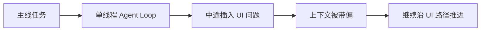
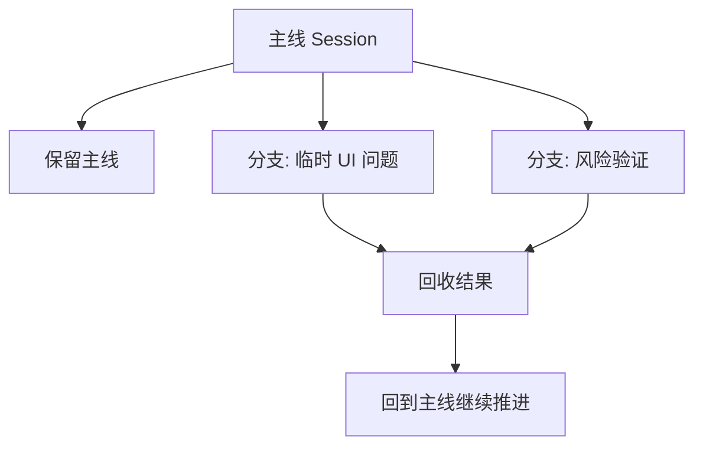
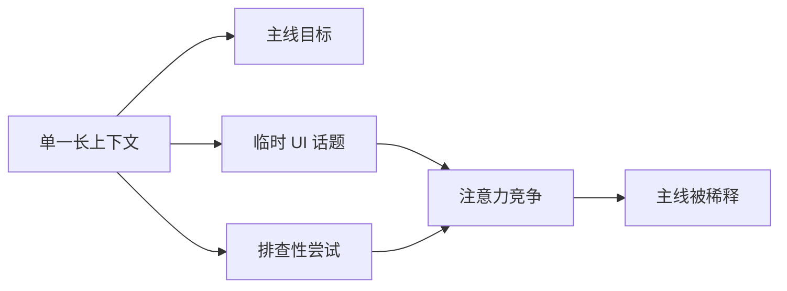
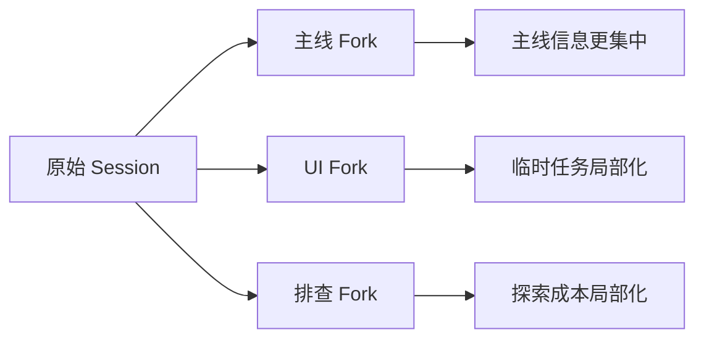
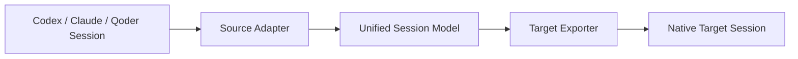
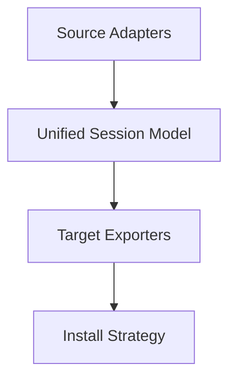

# 为什么我做了一个 `agent-session-bridge`

大多数人第一次用 coding agent，感受到的是“它会写代码”。  
但真正把它放进日常开发之后，更快碰到的问题其实不是代码生成，而是上下文管理。

我做 `agent-session-bridge`，源于两个很基础、但很实际的需求：

1. 迁移  
我希望把一个 agent 里的工作上下文，带到另一个 agent 里继续做，而不是重新解释一遍。

2. 分支  
我希望在同一个 CLI 里，把当前上下文直接复制成一个新分支，沿着另一个方向继续推进，而不是把原来的主线打乱。

这个项目本质上不是“聊天记录转换器”，而是在做一件更工程化的事：

把不同 agent 的 session 读出来，整理成一个统一的工作上下文模型，再导出成目标 agent 能继续使用的原生 session。

CLI 我给它取名叫 `kage`，就是借了“影”的意象，活跃一下气氛。  
不过这个名字背后的判断是认真的：未来更好的 agent，不该只会沿着一条上下文链往前冲，而应该能把当前工作记忆复制成多个分支去并行推进。

说得更私人一点，小时候看“影分身”这种设定，最容易被打动的其实不是战斗，而是那种很朴素的想象：

- 如果我能把自己复制成好几个
- 那我就能同时做几件事
- 做完以后还能把结果都带回来

今天回过头看 coding agent，我反而觉得这个想象挺贴切。  
软件工程从来都不是纯单线程活动，所以我想做的不是一个“更会聊天”的 agent，而是一个更接近“可以把工作记忆分出去”的工具。

## 为什么“影分身”这个比喻其实很贴切

这个比喻对我来说，不只是为了起一个名字。

如果把“影分身”的特征抽象一下，它大概有四个点：

- 复制当前状态
- 分支独立行动
- 每个分支只处理局部任务
- 最后把结果带回主线

这四件事和软件工程里的 branch / worktree / parallel track 很像，和我想做的 session fork 也很像。

所以 `kage` 想表达的不是“动漫彩蛋”，而是一种很实际的工程判断：

- 单线程 agent 更像一个强单兵
- forked session 更像把工作记忆复制成几个可并行推进的自己

这也是我后来决定把 fork 放到这个项目中心位置的原因。

## 先说背景：为什么 session 会成为一个问题

今天的 `Codex`、`Claude`、`Qoder` 这类工具，交互形式看上去像聊天，但它们真正依赖的并不是“这段聊天很像人类对话”，而是“这段历史承载了当前任务的工作记忆”。

用户一开始通常只会觉得：

- 我想把 `Claude -> Codex`
- 我想把 `Codex -> Claude`
- 我想把当前上下文复制出来，开一个新分支

但再往前走一步，就会发现这不是“导出一段 transcript”那么简单。

真正有价值的，不只是消息文本，还包括：

- 这个 session 是在什么工作目录里发生的
- 它对应的是哪一个项目
- 现在的任务主线是什么
- 哪些消息是真正有效的工作上下文

也就是说，agent session 比普通聊天记录更接近“当前工作状态的外显载体”。

## 为什么“分支”不是附加功能，而是核心需求

很多 agent 今天仍然是一个典型的 `agent loop`。

它的工作方式很像单线程：

- 拿到当前目标
- 沿着一条上下文链往前推进
- 每次基于最新的上下文继续思考和输出

这套机制很自然，但它和真实软件工程的工作方式其实有冲突。

软件工程天然适合并行化：

- 一个方向去查问题
- 一个方向去写实现
- 一个方向去做验证
- 一个方向去探索备选方案

而单线程 agent 往往把这些都压在一条上下文链里。结果就是两个问题。

### 1. 并行能力不足

人在做工程时，很自然会开很多分支。

比如你在做一个功能，脑子里可能同时有三件事：

- 主线实现怎么落
- 某个风险点要不要单独试一下
- 某个 UI 或交互要不要顺手调一下

人可以很自然地“先记住主线，再去开一个支线”。  
但单线程 agent 更像只有一个当前焦点，它很难同时稳定地保留几条独立任务线。

### 2. 注意力容易漂移

这其实是更现实的问题。

一个常见场景是：

- 原任务：实现“批量导入用户 CSV，并做字段校验和错误提示”
- 做到一半，用户突然说：“顺手把这个导入页的按钮和表单间距也改一下”

于是 agent 切去处理 UI 问题。

问题在于，UI 调整做完之后，它的上下文主导权已经被新的话题接管了。  
后面它继续往前做时，更容易沿着“页面结构、组件样式、视觉细节”这条线推进，而不是回到原来更重要的主线：

- CSV 解析策略
- 校验规则
- 错误反馈机制
- 导入流程的幂等性

这不是 agent “不聪明”，而是单线程上下文模型的结构性问题。

## 所以我对 agent 的一个判断是：未来不是更强的单兵，而是更好的分身系统

如果把今天的大多数 coding agent 看成一个单线程开发者，那么更合理的下一步，不是只让它“更会写代码”，而是让它更会管理上下文。

我更看好的方向是：

- 能识别主线任务和临时支线
- 能主动建议“这个问题最好单独开分支”
- 能把一个上下文复制成多个任务分身并行推进
- 能在最后把结果带回主线

现在有些系统已经开始有 `subagent` 或“并发任务”的能力，但大多数时候，这仍然是主 agent 控制下的辅助机制，还不是稳定的上下文分身系统。

它更像“我临时叫几个帮手”，而不是“我天然就是一个会组织多分身协作的工程系统”。

如果要打一个直观的比方，我觉得未来的 agent 更像 Naruto 的影分身：

- 不把全部注意力押在一个主线程上
- 而是能复制当前工作记忆
- 派出几个分身去不同方向推进
- 再把结果回收到主线

在这个视角下，fork 就不是一个方便功能，而是 agent 从“单线程助手”走向“工程系统”的基础能力。

## 各家现在其实都已经开始做“分身”，只是路线不一样

这件事并不是我一个人的想象。  
如果去看现在主流 agent 产品的设计，会发现大家其实都已经意识到单线程不够用了。

我自己的观察是，当前大致有三条路线。

### 1. `Claude` / `Qoder` 这类的 subagent

这条路线更像“角色化委派”。

`Claude Code` 已经有比较完整的 subagent 体系。官方文档里明确写了：

- Claude 会根据 subagent 的描述和当前请求决定是否委派
- subagent 默认是独立上下文
- 可以 resume 一个已有 subagent
- 但每次新的 subagent invocation，本质上仍然是 fresh context

`Qoder` 也已经走到这一步了：

- 可以隐式调用 subagent
- 也可以链式调用多个 subagent
- 还可以限制执行轮数

这条路线的优点很明显：

- 任务边界清晰
- 权限可以隔离
- 主线对话不会被所有中间细节淹没

但它更像“找一个专长角色去做事”，还不是“从当前自己完整的工作记忆复制出一个长期分支”。

### 2. `Codex` / `Cursor` 这类的并行 agent

这条路线更像“工程化并发”。

`OpenAI` 现在公开强调的是 multiple agents in parallel、separate threads、built-in worktrees、long-running tasks。  
`Cursor` 的 background agents 也是类似方向：独立环境、独立 branch、异步推进。

这已经很接近真正的多线程工程系统了。  
它的重点不是“一个 agent 更强”，而是“多个 agent 能同时干活”。

### 3. session fork

这一条恰好是我更关心的。

因为它解决的是一个很具体的问题：

- 我并不是每次都要从零叫一个新 agent
- 我只是想把当前已经形成的工作记忆复制一份
- 然后沿着另一个方向继续做

所以我会把这三条路线理解成不同层次的分身能力：

- `subagent` 更像“叫一个专长助手”
- `parallel agent` 更像“开一条真正独立的执行线程”
- `session fork` 更像“把我现在的工作记忆复制成一个新自己”

这三件事不是互斥的。  
恰恰相反，我觉得未来它们会合在一起。

## 所以 fork 和 subagent 的差别到底在哪

我不觉得这两者是谁替代谁。

更准确的说法应该是：

- subagent 解决的是“局部任务委派”
- fork 解决的是“主线工作记忆复制”

这两个动作看起来接近，但工程意义不一样。

举个最实际的区别：

- 如果我想让一个 agent 去独立做 code review，那很适合 subagent
- 如果我正在一个复杂功能里推进，突然想插入一个 UI 岔路，但又不想丢掉当前主线，那更适合 fork

所以我后来越来越觉得，fork 是比 subagent 更底层的一块基础设施。  
因为无论以后 subagent 做得多聪明，session 作为“可复制工作记忆单元”这件事，仍然会存在。

## 为什么 fork 对大模型和 agent 特别有效

如果只从产品直觉看，fork 很像“把对话复制一份”。  
但从大模型和 agent 的工作方式来看，它其实会直接改善上下文竞争问题。

先说大模型。

今天主流 LLM 基本都建立在 Transformer 之上，而 Transformer 的核心机制就是 attention。  
模型不是把上下文当成一个完全平坦的缓存区来读取，而是在生成当前 token 时，对上下文中不同位置分配不同权重。

这带来一个很重要的工程后果：

- 上下文越长，不同信息之间的竞争越强
- 不是所有历史内容都会被同等稳定地利用
- 任务意图一旦被新的话题稀释，模型后续更容易围绕更新、更近、或者形式上更显眼的信息继续生成

这并不等于“模型记不住”，而是说上下文利用本来就是有偏差、有选择的。

这一点在长上下文研究里已经很明显了。  
像 *Lost in the Middle* 这类工作表明，模型对长上下文里的信息使用，并不是均匀稳定的；中间位置的信息尤其容易被弱化。

这就能解释一个很常见的现象：

- 原任务明明还在上下文里
- 临时插入的问题也已经解决了
- 但后续生成还是更容易顺着新插入的话题继续走

因为从模型角度看，那条新话题已经改变了“当前最活跃的上下文分布”。

再说 agent。

很多 coding agent 的外层其实都可以理解为一种 loop：

1. 读取当前上下文
2. 生成下一步思考或动作
3. 把新的消息、结果、观察继续压回上下文
4. 再进入下一轮

像 *ReAct* 这样的工作，已经把这种“reasoning + acting interleaved”模式描述得很清楚了。  
它的优势很强，但副作用也明显：当前 loop 的状态高度依赖“最近被压进上下文的东西”。

所以 fork 的有效性，不只是交互层面的方便，而是有明确的技术原因。

我的判断是：

- fork 有效，不是因为模型突然更聪明了
- 而是因为它减少了无关上下文竞争
- 让当前分支里的目标、约束、近期决策和工作记忆更集中

换句话说，fork 做的是“上下文隔离”。

对人类工程师来说，这很像：

- 主线工作保留在原分支
- 临时问题放进新分支
- 风险探索放进另一个新分支

对 agent 来说，这同样成立。  
只不过它隔离的不是 Git 提交，而是下一轮生成时要参与竞争的工作上下文。

## 什么是 agent session

我觉得理解这个项目，先要理解什么是 session。

session 不是“我和 agent 的聊天记录”这么简单。  
它更像是 agent 当前工作记忆在本地磁盘上的投影。

不同 agent 的格式当然不一样，但它们通常都会表达几件核心事实：

- session id
- 当前工作目录
- 一串按时间推进的消息
- 一些补充元数据

在这个项目里，三个源端的特点大致是这样的：

- `Codex`  
  session 里有比较明确的 `session_meta`，工作目录也比较直接。

- `Claude`  
  transcript 是 `jsonl`，很多信息是按消息行写出来的，`cwd` 和 `sessionId` 需要从记录里提取。

- `Qoder / QoderCLI`  
  transcript 之外还有 sidecar 文件，像标题、工作目录、更新时间这类信息通常更适合从 sidecar 里拿。

所以 session 的本质不是“统一文本”，而是“不同 agent 用不同格式保存同一类工作记忆”。

## `resume` 到底在恢复什么

做这个项目时，我有一个收获特别明显：

大家嘴上都说 `resume`，但各家的“恢复”其实并不是同一件事。

从我本机的真实 session 文件来看，它们更接近“重建可继续的工作记忆”，而不是“恢复一个完整运行中的 agent 进程”。

### `Codex`

`Codex` 本地是单个 `jsonl` 文件，放在 `~/.codex/sessions/YYYY/MM/DD/...` 下。  
真实样本里，第一行是 `session_meta`，后面除了用户和助手消息，还有：

- `event_msg`
- `reasoning`
- `token_count`
- `task_complete`

也就是说，`Codex` 的 session 更像一份事件日志。  
从本地样本推断，`codex resume <id>` 至少依赖标准目录和 `session_meta.payload.id` 这一层结构。

### `Claude`

`Claude` 本地通常是单个 `jsonl` transcript，放在 `~/.claude/projects/<project-key>/...` 下。  
真实样本里能看到：

- `file-history-snapshot`
- `user`
- `assistant`

每条消息自己带 `cwd`、`sessionId`、`timestamp` 和链式关系。

官方文档里有一个很值得注意的点：  
`resume` 在底层上仍然会启动一个新的 session，只是沿用既有上下文。

这和很多人的直觉不太一样。  
它说明 `resume` 更像“基于已保存的 session 重新接上工作记忆”，而不一定是把原执行现场原封不动接回来。

### `Qoder`

`Qoder` 在我本机的真实结构里，确实是两个文件：

- 一个 `jsonl`
- 一个 `-session.json`

这里你的直觉接近，但不完全对。  
`-session.json` 不是“总结正文”，更像 sidecar 元数据，里面主要是：

- `id`
- `title`
- `working_dir`
- `created_at` / `updated_at`
- token / cost / call 统计
- `context_usage_ratio`

真正的消息流还是在 `jsonl` 里。

所以如果把三家放在一起看：

- `Codex` 更像事件日志型 session
- `Claude` 更像消息链型 transcript
- `Qoder` 更像消息流加 sidecar 元数据

这也是为什么 `agent-session-bridge` 不能只做“文本转文本”，而是必须先抽一层统一 session 模型。

## 为什么这个项目没有直接做“聊天转聊天”

如果只是为了给另一个 agent 看内容，复制粘贴 transcript 就够了。  
但那样做有两个问题：

1. 丢失工作上下文  
工作目录、session id、agent 侧识别方式都没了。

2. 不能自然接续  
目标 agent 看到的是一段文本，不是它自己的 session。

所以这个项目选择的是另一条路：

先标准化，再导出原生格式。

也就是：

1. 从源 agent 读取本地 session
2. 解析成统一 session 模型
3. 根据目标 agent 的格式导出
4. 如果目标 agent 支持，就直接安装到它默认识别的位置

## 统一模型是这个项目里最关键的一层

这个项目内部真正重要的，不是某个格式转换函数，而是中间那层统一模型。

我把不同 source 先整理成一个共同结构，核心只保留这些字段：

- `agent`
- `sessionPath`
- `sessionId`
- `cwd`
- `title`
- `updatedAt`
- `messages`

这样做的意义很直接：

- source adapter 只负责“读懂自己的格式”
- target exporter 只负责“写出目标格式”
- 中间层不关心源和目标具体是谁

这就把问题拆开了。

你要新增一个 source，只需要解决“怎么读”；  
你要新增一个 target，只需要解决“怎么写”。

## 大致实现思路

整个实现可以分成四层。

### 1. Source adapters

这一层负责三件事：

- 发现本地 session 在哪里
- 找出和当前工作目录最相关的 session
- 解析原始格式，提取出统一模型

这里最重要的一点不是“找最新文件”，而是“找和当前目录真正匹配的 session”。  
否则同一个人同一天开了很多会话，很容易拿错。

所以项目里做的不是简单的 latest，而是：

- 先按当前工作目录匹配
- 如果命中多个，就让用户选
- 如果是非交互环境，就要求显式传 `--session-id`

### 2. Session transforms

这一层负责 fork 和 split。

它不碰目标格式，只处理统一模型：

- `split-recent`：裁掉旧上下文，只保留最近若干轮真实用户任务
- `fork`：在当前上下文上追加一个新的用户 prompt

本质上，这就是把“从已有工作记忆复制出一个新分支”这件事正式化。

### 3. Target exporters

这一层负责把统一模型写成目标 agent 的原生 session。

例如：

- 写成 `Codex` 能识别的 `session_meta + message rows`
- 写成 `Claude` 能识别的 `jsonl` transcript
- 写成 `Qoder` 需要的 `jsonl + sidecar`

目标不是“长得像”，而是“尽量让目标 agent 真正接得住”。

### 4. Install strategy

最后一层负责决定文件写到哪里。

如果目标是支持 resume 的 agent，就直接落到它默认查找的目录：

- `Codex` 写到 `~/.codex/sessions/YYYY/MM/DD/...`
- `Claude` 写到 `~/.claude/projects/<project-key>/...`

这样导出完以后，就不只是“拿到一个文件”，而是可以直接继续：

- `codex resume <session-id>`
- `claude --resume <session-id>`

而像 `Qoder` 目前还没有稳定的 resume 能力，就先导出为原生格式文件，等它后续支持。

## 官方和社区其实都已经在补这块，只是切口不同

我做这个项目之前，也查过现在有没有现成东西已经把这件事做完了。

结论是：有相邻方向，但还没有一个我满意的组合。

官方这边已经做了很多：

- `Claude` 和 `Qoder` 在做 subagent
- `Codex` 和 `Cursor` 在做 parallel agent / background agent / worktree

这说明“单线程 agent 不够用”已经是行业共识了。  
但这些能力基本都发生在各自产品内部，还不是“跨 agent 的 native session bridge”。

社区里也能看到一些相邻项目：

- 有的在做 Claude session 管理
- 有的在做 transcript 提取
- 有的在做多 agent 可视化面板

但我还没看到一个工具，刚好把这三件事同时做顺：

- 读取本地原生 session
- 在不同 agent 之间转成原生可继续的 session
- 把既有 session 直接 fork 成新的工作分支

所以这个项目真正补的空白，不是“第一个意识到 agent 要并行化”，而是：

把 session 当成一个可以被读取、复制、转译、恢复的工程单元。

## 这个项目真正想解决的，不只是“Claude 到 Codex”

表面上看，它像一个桥接工具：

- `Claude -> Codex`
- `Codex -> Claude`
- `Qoder -> Codex`

但对我来说，更重要的是另外一层：

session 应该成为 agent 时代最基础的工程单位之一。

因为只有当 session 可以：

- 被读取
- 被理解
- 被复制
- 被裁剪
- 被导出
- 被恢复

agent 才有机会从“单条会话里的智能体”，变成“可管理、可分叉、可迁移的工程系统”。

## 当前边界

这个项目目前迁移的是可见上下文，不是完整运行时。

它保留的是：

- 任务语义
- 消息历史
- 工作目录
- 基本会话元数据

它不保留的是：

- 隐藏推理
- 工具运行时状态
- UI 状态
- 某些 agent 的内部执行现场

所以它更像是在迁移“工作记忆”，而不是完整迁移一个正在运行的 agent 进程。

这也是我觉得它现在最合适的定位：

不是神奇魔法，而是一个实用的 session bridge，也是一个关于 agent session 应该如何被看待、如何被工程化的实验。

## References

- Vaswani et al. *Attention Is All You Need*. 2017. https://arxiv.org/abs/1706.03762
- Liu et al. *Lost in the Middle: How Language Models Use Long Contexts*. 2023. https://arxiv.org/abs/2307.03172
- Yao et al. *ReAct: Synergizing Reasoning and Acting in Language Models*. 2023. https://arxiv.org/abs/2210.03629
- Anthropic. *Claude Code Subagents*. https://code.claude.com/docs/en/sub-agents
- Anthropic. *Claude Code CLI Reference*. https://docs.anthropic.com/en/docs/claude-code/cli-reference
- Anthropic. *Claude Code Hooks*. https://docs.anthropic.com/en/docs/claude-code/hooks
- Qoder. *Subagent*. https://docs.qoder.com/en/cli/user-guide/subagent
- OpenAI. *Introducing the Codex app*. https://openai.com/index/introducing-the-codex-app/
- OpenAI. *Introducing Codex*. https://openai.com/index/introducing-codex/
